<!-- ╔══════════════════════════════════════════════════════════════╗ -->
<!-- ║  notevil076 · GitHub Profile README                        ║ -->
<!-- ║  Drop this into: github.com/notevil076/notevil076/README.md║ -->
<!-- ╚══════════════════════════════════════════════════════════════╝ -->

<div align="center">

<!-- BANNER — replace with your own hosted image -->
<!-- Recommended: 1400×400 dark banner with the knot logo + "not" branding -->
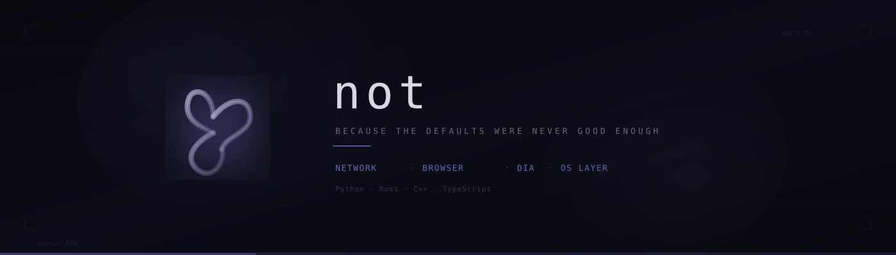

<br/>

```
I don't build apps. I rebuild what shouldn't need rebuilding.
```

<br/>

[](https://t.me/notevil076)
[](mailto:notevil076@gmail.com)

</div>

---

<br/>

## `$ whoami`

Solo developer obsessed with dark interfaces, native performance, and the idea that Windows deserves better software. Everything I make lives under one name: **not** — a collection of tools that replace what's broken with something that isn't.

Each project shares the same DNA: **glass morphism, violet accents, liquid geometry, zero bloat.**

<br/>

## ◆ THE ECOSYSTEM

<br/>

<!-- ═══════════════════ not NETWORK ═══════════════════ -->

<table>
<tr>
<td width="140" align="center">
<br/>
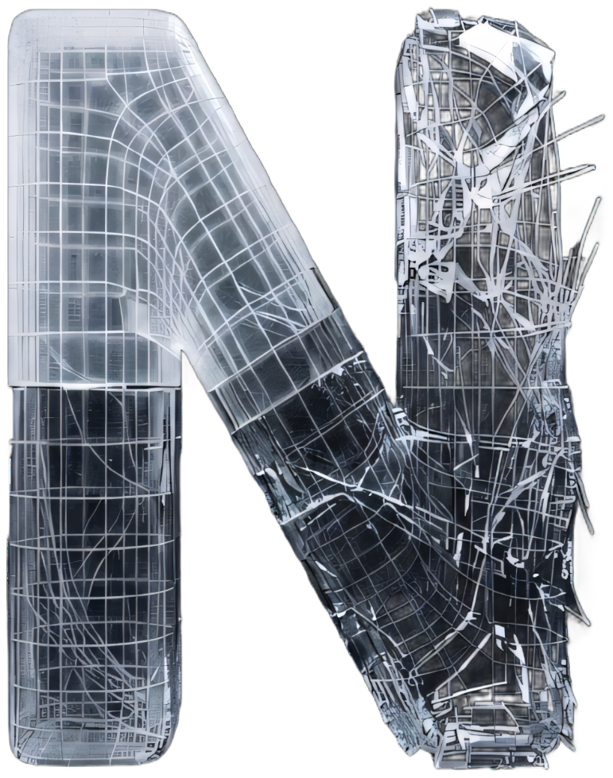
<br/>
<sub><b>not NETWORK</b></sub>
<br/><br/>
</td>
<td>

### not NETWORK
**Custom VPN client for Windows**
<br/>

A from-scratch VPN client built on **sing-box** core with full protocol support. Not a wrapper — a complete reimagining of what a VPN GUI should be.

`Python` `PyQt6` `sing-box` `VLESS/Reality` `Hysteria2` `WebChannel`

**What's inside:**
— VLESS + Reality & Hysteria2 protocol support via sing-box core
— System Proxy (SOCKS/HTTP) and TUN mode (kernel-level, all traffic)
— Kill switch, auto-connect, server node management with tagging
— Real-time traffic stats, throughput graphs, connection history
— Import servers via share links or manual key entry
— Full HTML/CSS/JS interface rendered through QWebEngine
— ~3800 lines of Python, single-file architecture

<br/>

> **Status:** ✅ Complete — daily driver

<br/>

<details>
<summary><b>📸 Screenshots</b></summary>
<br/>

<!-- Replace these with actual paths after uploading to your repo -->
| Home | Servers | Stats | Settings |
|:---:|:---:|:---:|:---:|
| 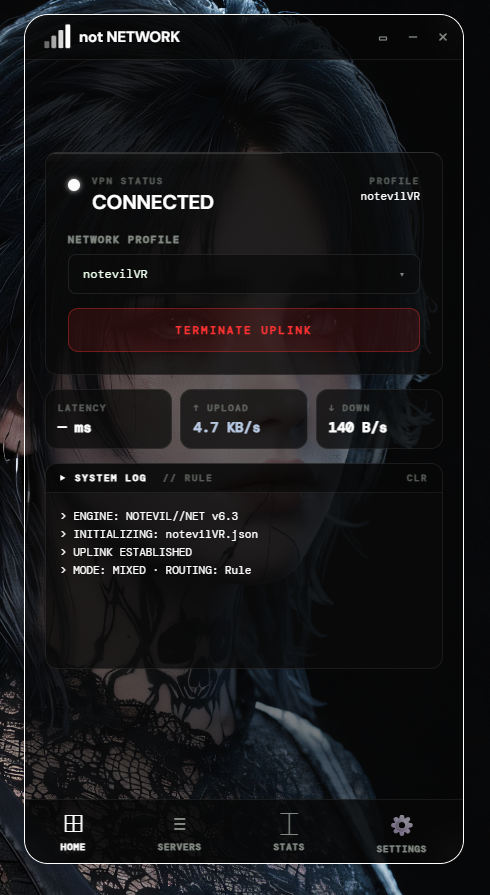 | 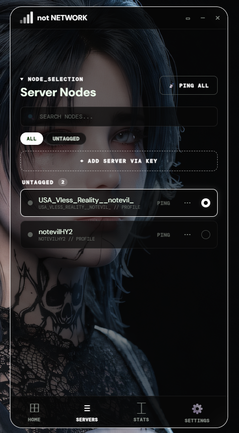 | 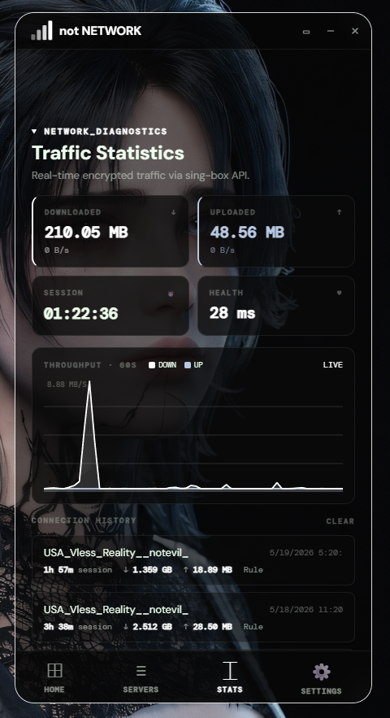 | 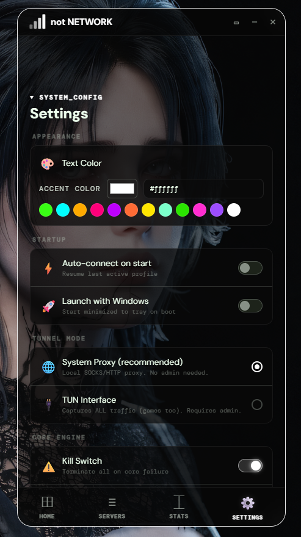 |

</details>

</td>
</tr>
</table>

<br/>

<!-- ═══════════════════ not BROWSER ═══════════════════ -->

<table>
<tr>
<td width="140" align="center">
<br/>
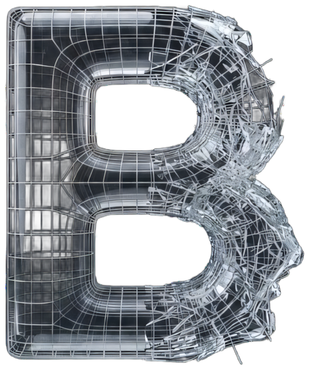
<br/>
<sub><b>not BROWSER</b></sub>
<br/><br/>
</td>
<td>

### not BROWSER
**Minimal web browser built on Tauri 2**
<br/>

A lightweight, privacy-first browser with a custom new tab experience — weather, quick access, workspace management, and real-time performance stats. Built with Tauri 2 for native speed with a web-tech frontend.

`Rust` `Tauri 2` `TypeScript` `Vite` `HTML/CSS`

**What's inside:**
— Tauri 2 + Rust backend with Chromium-based webview
— Custom new tab: clock, weather, search, quick access tiles
— Workspace system (group tabs by context)
— Built-in tracker blocking, RAM usage display, ad counter
— Brave / Google / DuckDuckGo search engine switcher
— Custom glassmorphism UI with the "not" design language

<br/>

> **Status:** 🔧 Functional — in active development

<br/>

<details>
<summary><b>📸 Screenshot</b></summary>
<br/>
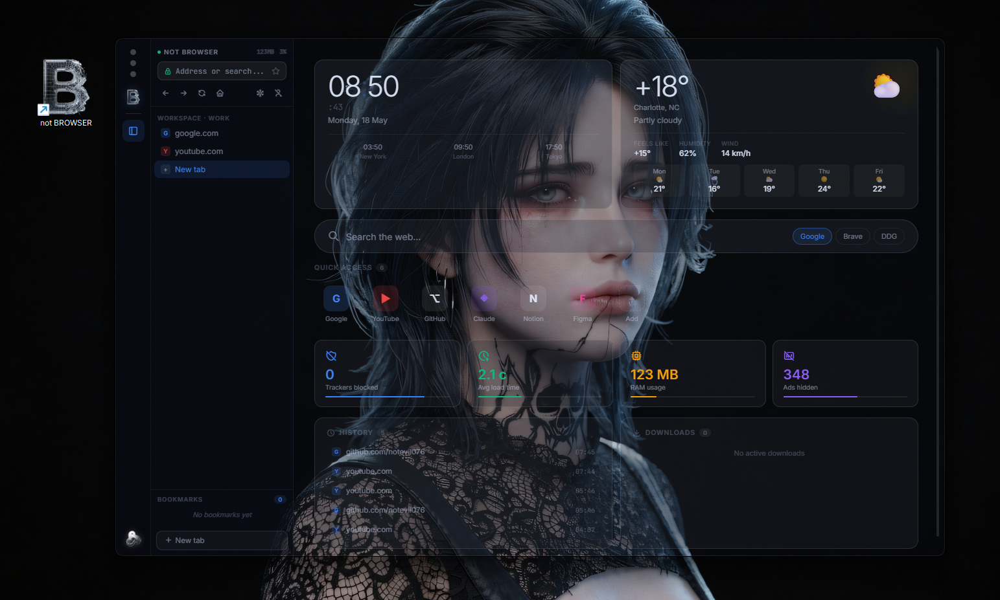
</details>

</td>
</tr>
</table>

<br/>

<!-- ═══════════════════ not DIA ═══════════════════ -->

<table>
<tr>
<td width="140" align="center">
<br/>

<br/>
<sub><b>not DIA</b></sub>
<br/><br/>
</td>
<td>

### not DIA
**Secure messenger — [diatalk.ru](https://diatalk.ru)**
<br/>

A self-hosted real-time messenger with a full-featured backend and PWA frontend. Groups, reactions, voice messages, forwarding, push notifications — the works.

`Python` `FastAPI` `SQLAlchemy` `WebSocket` `Web Push` `PWA`

**What's inside:**
— FastAPI + WebSocket backend, real-time message delivery
— DM and group chats with admin controls
— Reactions, replies, forwarding, message pinning
— Voice messages, image/video/file sharing
— Push notifications (VAPID/Web Push)
— Multiple color themes (default, midnight, rose, forest)
— Installable as PWA, mobile-responsive
— ~2400 lines across backend + frontend

<br/>

> **Status:** 🔧 Working — in development &nbsp;·&nbsp; **Live:** [diatalk.ru](https://diatalk.ru)

<br/>

<details>
<summary><b>📸 Screenshots</b></summary>
<br/>

| Login | Chat |
|:---:|:---:|
| 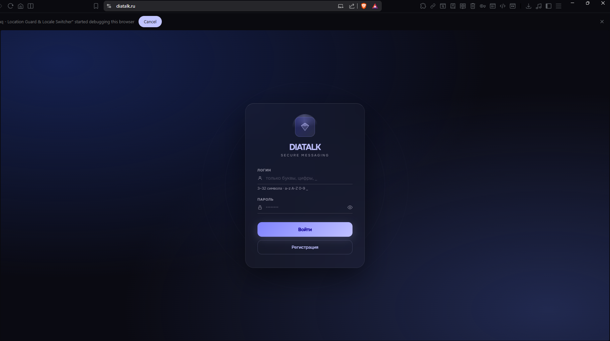 |  |

</details>

</td>
</tr>
</table>

<br/>

<!-- ═══════════════════ not OS LAYER ═══════════════════ -->

<table>
<tr>
<td width="140" align="center">
<br/>
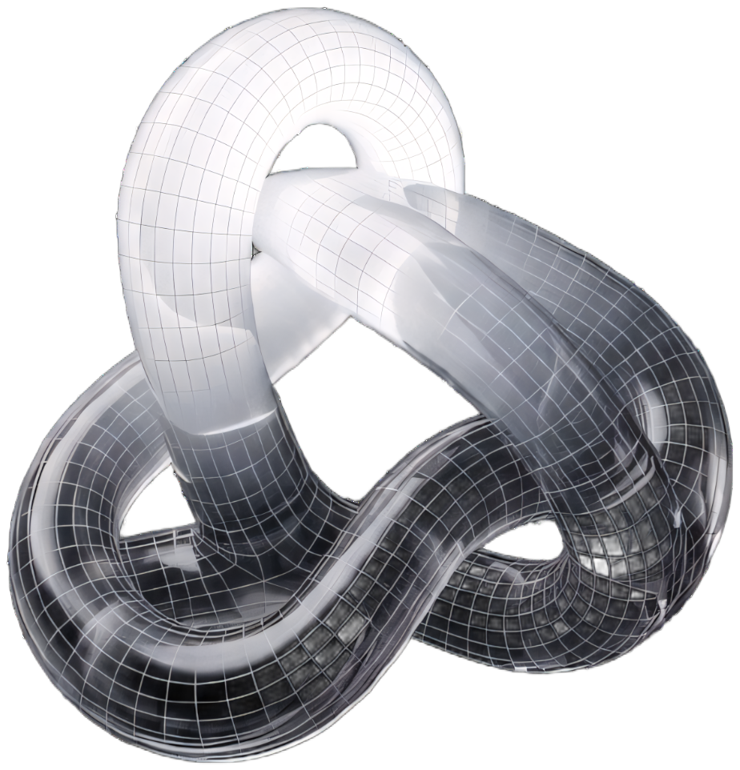
<br/>
<sub><b>not OS Layer</b></sub>
<br/><br/>
</td>
<td>

### not OS Layer
**A complete shell layer for Windows 11**
<br/>

The endgame. A native C++ overlay system that replaces Windows 11's shell components — taskbar, control center, file explorer, cursors, icons, media overlays — with a cohesive glass-morphism interface. Built directly on Win32, Direct2D, Direct3D, and DirectComposition for zero-compromise performance.

`C++` `Win32 API` `Direct2D` `Direct3D` `DirectComposition` `COM`

**What's inside:**
— Custom taskbar with centered app icons, dynamic system tray, live previews
— Full control center: system status, connectivity, audio, power, display, personalization
— Redesigned file explorer with preview pane, file tagging, cloud integration
— Liquid-glass cursor system with 30+ cursor types
— Custom icon pack for system, folders, file types, and apps
— Media bar & volume overlays with multiple display modes
— Spring-physics animation engine (easing, spring.cpp)
— Design token system (color, motion, spacing, typography)
— System HUD blocker (hides native Windows overlays)

<br/>

> **Status:** 🚧 Early development — concept & architecture phase

<br/>

<details>
<summary><b>📸 Concepts</b></summary>
<br/>

| Taskbar | Control Center |
|:---:|:---:|
| 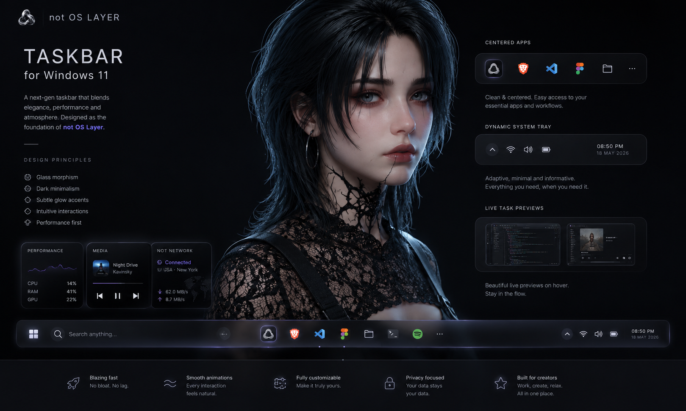 | 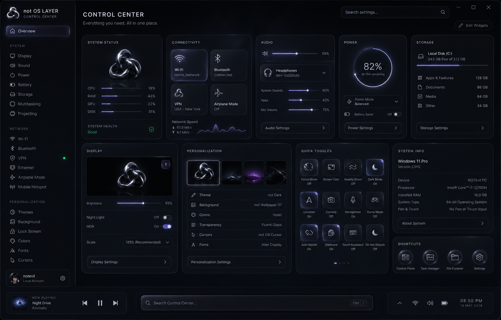 |

| Explorer | Cursors |
|:---:|:---:|
| 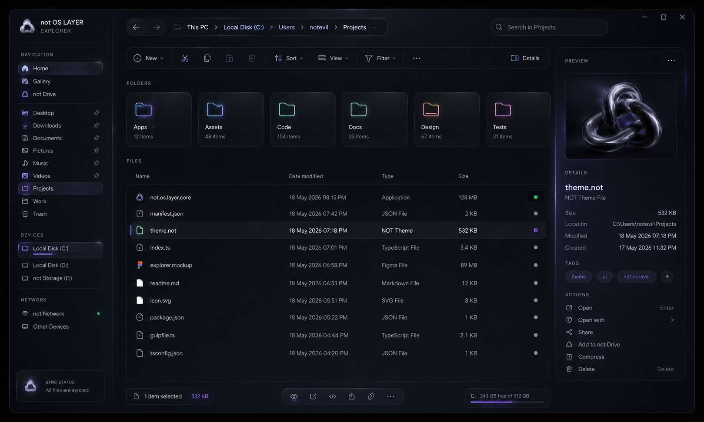 | 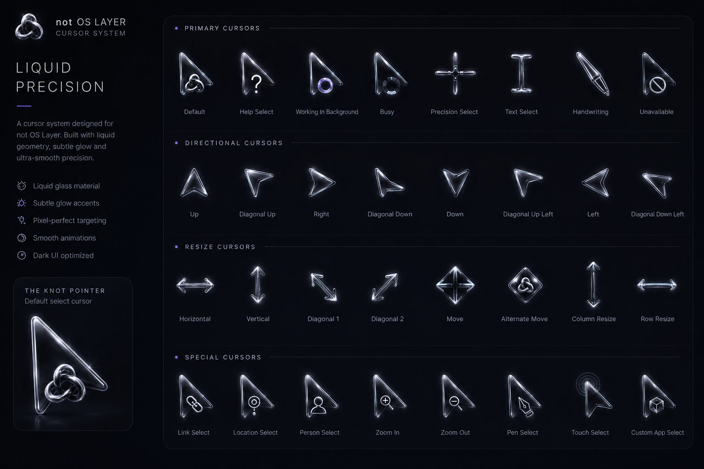 |

| Icons | Media & Volume |
|:---:|:---:|
| 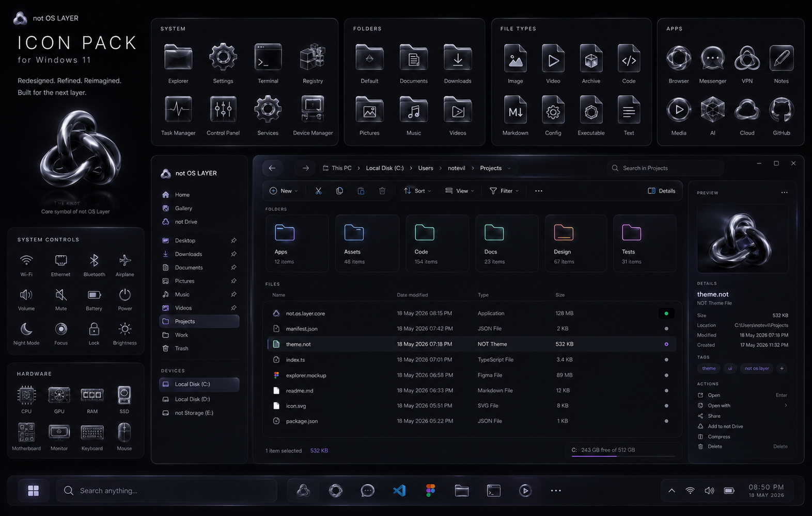 | 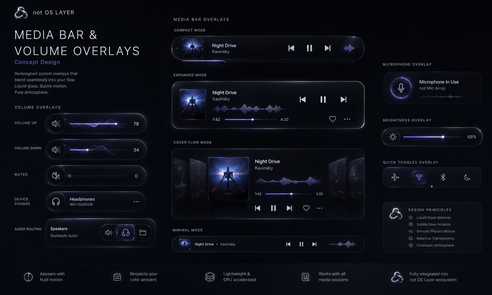 |

</details>

</td>
</tr>
</table>

<br/>

---

<br/>

## ◆ STACK

<div align="center">

| Layer | Technologies |
|:---|:---|
| **Languages** | `Python` · `Rust` · `C++` · `TypeScript` · `HTML/CSS` · `SQL` |
| **Frameworks** | `PyQt6` · `FastAPI` · `Tauri 2` · `Vite` |
| **System** | `Win32 API` · `Direct2D` · `Direct3D` · `DirectComposition` · `COM` |
| **Networking** | `sing-box` · `VLESS/Reality` · `Hysteria2` · `WebSocket` · `Web Push` |
| **Data** | `SQLAlchemy` · `SQLite` · `PostgreSQL` |
| **Design** | `Glass morphism` · `Design tokens` · `Spring physics` · `Figma` |

</div>

<br/>

---

<br/>

## ◆ DESIGN LANGUAGE

Every "not" project follows the same visual system:

```
◇ Glass morphism          — translucent layers, depth through blur
◇ Dark minimalism         — pitch-black backgrounds, zero visual noise
◇ Violet accents          — #8083ff as the signature color
◇ Liquid geometry          — the knot symbol, metallic 3D forms
◇ Subtle glow             — soft light that guides, never distracts
◇ Performance first       — GPU-accelerated, native where possible
```

<div align="center">
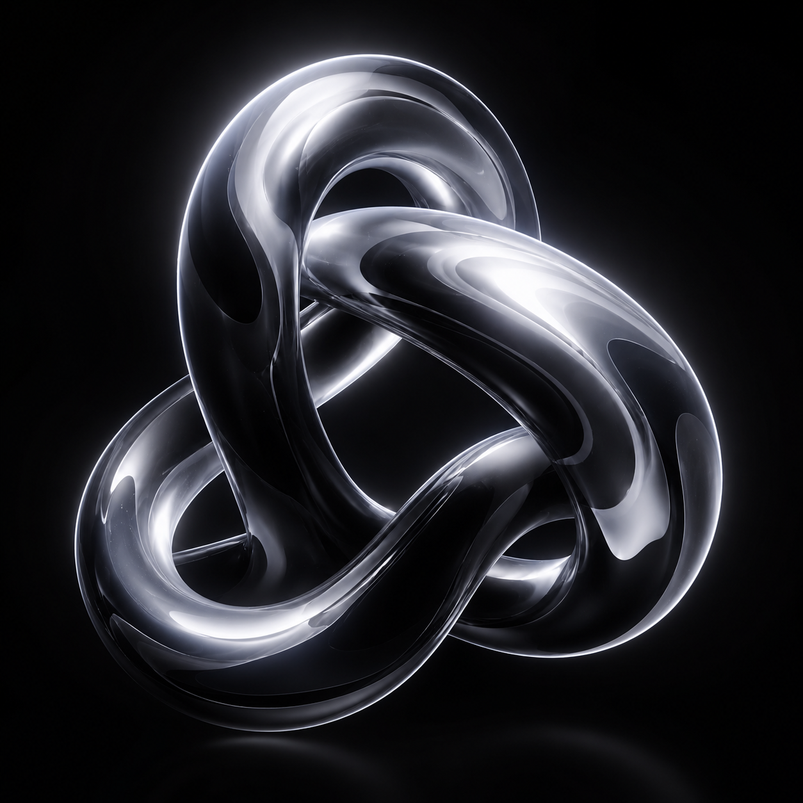
<br/>
<sub>The Knot — core symbol of the not ecosystem</sub>
</div>

<br/>

---

<br/>

<div align="center">

```
not — because the defaults were never good enough.
```

<br/>

[](https://t.me/notevil076)
[](mailto:notevil076@gmail.com)

</div>
